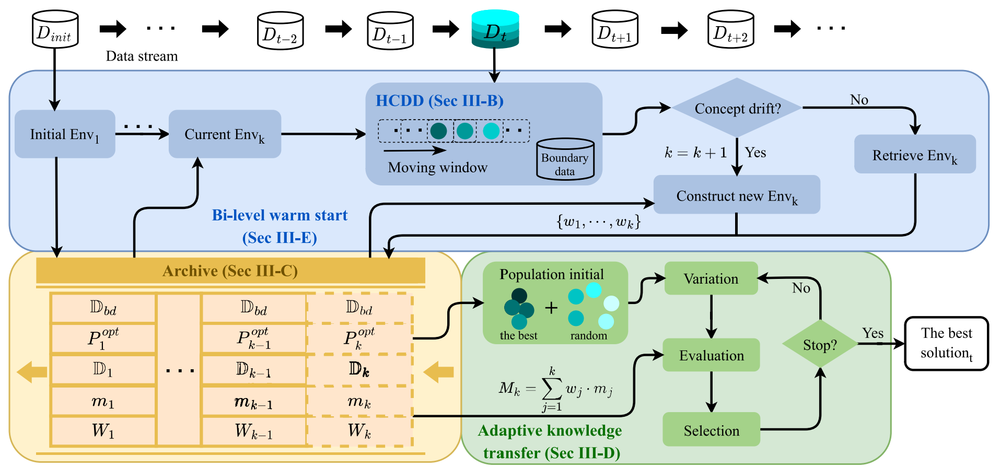

# DASE

Streaming Data-Driven Evolutionary Algorithms (SDDEAs) have emerged as a crucial paradigm in the area of data-driven optimization. However, current methods face critical limitations when handling unpredictable concept drifts in continuously evolving environments.
To address this research gap, we propose DASE, a <u>D</u>rift-<u>A</u>ware <u>S</u>treaming <u>E</u>volutionary algorithm that features two key innovations. 

First, we introduce a hierarchical confidence drift detector that operates on a moving window over continuous data streams, identifying concept drifts by evaluating statistical deviations in model accuracy.
Second, we propose a context-aware warm start mechanism that adaptively transfers knowledge from historical environments to the new environment using environmental similarity-based weighting.
These dual innovations not only enables automatic segmentation of streaming data into coherence environments but also  enhances optimization performance with the real-time responsiveness.




# Quick start

Please run the ''main\_SDDObench.py''

# Citation
If you find our SDDObench has given you some help, please cite it in your publications or projects:

```latex
@article{zhong2025data,
  title={Data-Driven Evolutionary Computation Under Continuously Streaming Environments: A Drift-Aware Approach},
  author={Zhong, Yuan-Ting and Gong, Yue-Jiao},
  journal={IEEE Transactions on Evolutionary Computation},
  year={2025},
  publisher={IEEE}
}
```


